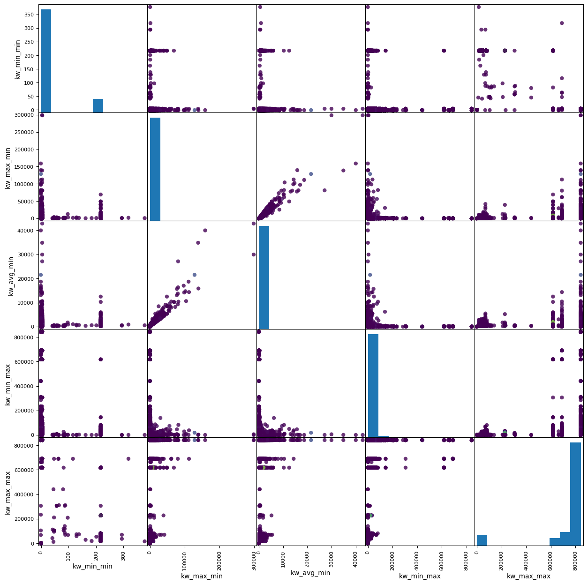
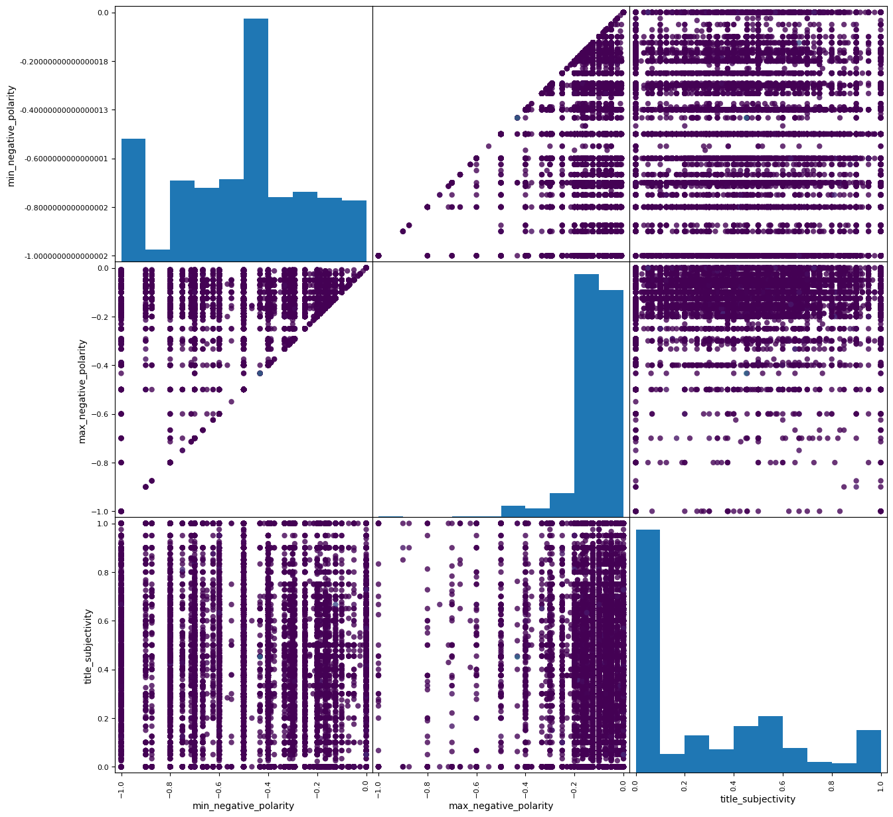
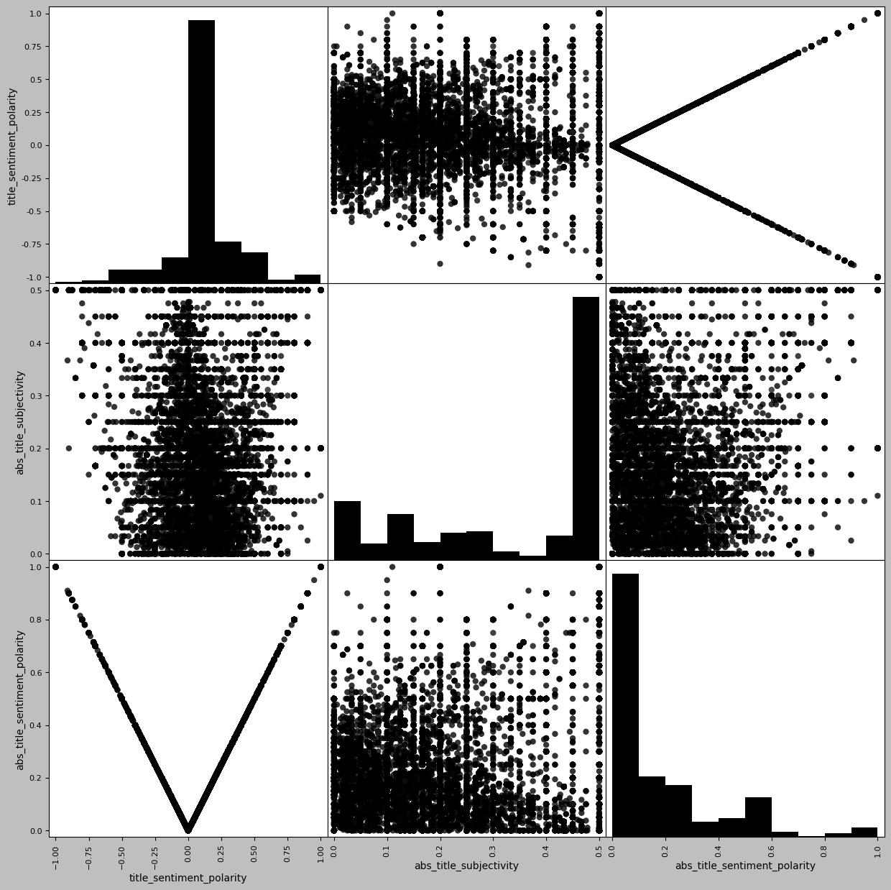

# Topic : Predicting the number of shares that a news will receive


<div class="alert alert-block alert-success">
<br></b> The Online news popularity dataset was sourced from UCI Machine learning repository.  </br>
    <br><a href="http://archive.ics.uci.edu/ml/datasets/Online+News+Popularity">UCI Machine learning repository - in vehicle coupon recommendation dataset</a>
</div>


### Summary
The dataset contains numerous articles published by Mashable. Each row consist of an article that was published, their URL, number of tokens, links, images, videos, keywords, polairty, day on which it was published,medium of publish, positive and negative words in the article, closeness to 5 different LDA topic models and finally the number of shares that this article received. 

The goal of this project is to develop a machine learning model that can predict number of shares / reach an article would receive given various features. 

Machine Learning models that were used are : 
- K Nearest Neighbour 
- Linear Regression
- Ridge Regression
- Lasso Regression
- Polynomial Regression
- Support Vector Machines - Linear, RBF and Polynomial kernels
- Linear Support Vector Machines
- Decision Tree
- Stochastic Gradient 
- Bagging 
- Pasting
- Boosting : Ada Boost, Gradient Boosting  


## Context of the document : 
    
    1. Data Description 
    2. Null value imputation and feature selection
    3. Exploratory data analysis
    4. Data cleaning and imputation
    5. Modelling 
    6. Conclusion

## 1. Data description 

     1. url:                           URL of the article
     2. timedelta:                     Days between the article publication and
                                       the dataset acquisition
     3. n_tokens_title:                Number of words in the title
     4. n_tokens_content:              Number of words in the content
     5. n_unique_tokens:               Rate of unique words in the content
     6. n_non_stop_words:              Rate of non-stop words in the content
     7. n_non_stop_unique_tokens:      Rate of unique non-stop words in the
                                       content
     8. num_hrefs:                     Number of links
     9. num_self_hrefs:                Number of links to other articles
                                       published by Mashable
    10. num_imgs:                      Number of images
    11. num_videos:                    Number of videos
    12. average_token_length:          Average length of the words in the
                                       content
    13. num_keywords:                  Number of keywords in the metadata
    14. kw_min_min:                    Worst keyword (min. shares)
    15. kw_max_min:                    Worst keyword (max. shares)
    16. kw_avg_min:                    Worst keyword (avg. shares)
    17. kw_min_max:                    Best keyword (min. shares)
    18. kw_max_max:                    Best keyword (max. shares)
    19. kw_avg_max:                    Best keyword (avg. shares)
    20. kw_min_avg:                    Avg. keyword (min. shares)
    21. kw_max_avg:                    Avg. keyword (max. shares)
    22. kw_avg_avg:                    Avg. keyword (avg. shares)
    23. self_reference_min_shares:     Min. shares of referenced articles in
                                       Mashable
    24. self_reference_max_shares:     Max. shares of referenced articles in
                                       Mashable
    25. self_reference_avg_sharess:    Avg. shares of referenced articles in
                                       Mashable
    26. is_weekend:                    Was the article published on weekend                
    27. LDA_00:                        Closeness to LDA topic 0
    28. LDA_01:                        Closeness to LDA topic 1
    29. LDA_02:                        Closeness to LDA topic 2
    30. LDA_03:                        Closeness to LDA topic 3
    31. LDA_04:                        Closeness to LDA topic 4
    32. global_subjectivity:           Text subjectivity
    33. global_sentiment_polarity:     Text sentiment polarity
    34. global_rate_positive_words:    Rate of positive words in the content
    35. global_rate_negative_words:    Rate of negative words in the content
    36. rate_positive_words:           Rate of positive words among non-neutral
                                       tokens
    37. rate_negative_words:           Rate of negative words among non-neutral
                                       tokens
    38. avg_positive_polarity:         Avg. polarity of positive words
    39. min_positive_polarity:         Min. polarity of positive words
    40. max_positive_polarity:         Max. polarity of positive words
    41. avg_negative_polarity:         Avg. polarity of negative  words
    42. min_negative_polarity:         Min. polarity of negative  words
    43. max_negative_polarity:         Max. polarity of negative  words
    44. title_subjectivity:            Title subjectivity
    45. title_sentiment_polarity:      Title polarity
    46. abs_title_subjectivity:        Absolute subjectivity level
    47. abs_title_sentiment_polarity:  Absolute polarity level
    48. shares:                        Number of shares (target)
    49. datachannel:                   Channel in which the news was published (categorical)
    50. day_of_week:                   Day on which the article was published(categorical)
   


```python
import pandas as pd
import numpy as np
import matplotlib.pyplot as plt
```


```python
regdata = pd.read_csv("online_news_popularity.csv")
```

    The raw dataset contains about 40k rows and 50 columns
    There are no missing values in the dataset 


```python
regdata.info()
```

    <class 'pandas.core.frame.DataFrame'>
    RangeIndex: 39644 entries, 0 to 39643
    Data columns (total 51 columns):
     #   Column                        Non-Null Count  Dtype  
    ---  ------                        --------------  -----  
     0   Unnamed: 0                    39644 non-null  int64  
     1   url                           39644 non-null  object 
     2   timedelta                     39644 non-null  int64  
     3   n_tokens_title                39644 non-null  int64  
     4   n_tokens_content              39644 non-null  int64  
     5   n_unique_tokens               39644 non-null  float64
     6   n_non_stop_words              39644 non-null  float64
     7   n_non_stop_unique_tokens      39644 non-null  float64
     8   num_hrefs                     39644 non-null  int64  
     9   num_self_hrefs                39644 non-null  int64  
     10  num_imgs                      39644 non-null  int64  
     11  num_videos                    39644 non-null  int64  
     12  average_token_length          39644 non-null  float64
     13  num_keywords                  39644 non-null  int64  
     14  kw_min_min                    39644 non-null  int64  
     15  kw_max_min                    39644 non-null  float64
     16  kw_avg_min                    39644 non-null  float64
     17  kw_min_max                    39644 non-null  int64  
     18  kw_max_max                    39644 non-null  int64  
     19  kw_avg_max                    39644 non-null  float64
     20  kw_min_avg                    39644 non-null  float64
     21  kw_max_avg                    39644 non-null  float64
     22  kw_avg_avg                    39644 non-null  float64
     23  self_reference_min_shares     39644 non-null  float64
     24  self_reference_max_shares     39644 non-null  float64
     25  self_reference_avg_sharess    39644 non-null  float64
     26  is_weekend                    39644 non-null  int64  
     27  LDA_00                        39644 non-null  float64
     28  LDA_01                        39644 non-null  float64
     29  LDA_02                        39644 non-null  float64
     30  LDA_03                        39644 non-null  float64
     31  LDA_04                        39644 non-null  float64
     32  global_subjectivity           39644 non-null  float64
     33  global_sentiment_polarity     39644 non-null  float64
     34  global_rate_positive_words    39644 non-null  float64
     35  global_rate_negative_words    39644 non-null  float64
     36  rate_positive_words           39644 non-null  float64
     37  rate_negative_words           39644 non-null  float64
     38  avg_positive_polarity         39644 non-null  float64
     39  min_positive_polarity         39644 non-null  float64
     40  max_positive_polarity         39644 non-null  float64
     41  avg_negative_polarity         39644 non-null  float64
     42  min_negative_polarity         39644 non-null  float64
     43  max_negative_polarity         39644 non-null  float64
     44  title_subjectivity            39644 non-null  float64
     45  title_sentiment_polarity      39644 non-null  float64
     46  abs_title_subjectivity        39644 non-null  float64
     47  abs_title_sentiment_polarity  39644 non-null  float64
     48  shares                        39644 non-null  int64  
     49  datachannel                   39644 non-null  object 
     50  day_of_week                   39644 non-null  object 
    dtypes: float64(34), int64(14), object(3)
    memory usage: 15.4+ MB


## 2. Null value imputation and feature selection


```python
# Drops first 3 columns, as they're not useable for prediction
regdata.drop(regdata.iloc[:, 0:3], inplace = True, axis = 1)
regdata.describe()
```


<div>
<style scoped>
    .dataframe tbody tr th:only-of-type {
        vertical-align: middle;
    }

    .dataframe tbody tr th {
        vertical-align: top;
    }

    .dataframe thead th {
        text-align: right;
    }
</style>
<table border="1" class="dataframe">
  <thead>
    <tr style="text-align: right;">
      <th></th>
      <th>n_tokens_title</th>
      <th>n_tokens_content</th>
      <th>n_unique_tokens</th>
      <th>n_non_stop_words</th>
      <th>n_non_stop_unique_tokens</th>
      <th>num_hrefs</th>
      <th>num_self_hrefs</th>
      <th>num_imgs</th>
      <th>num_videos</th>
      <th>average_token_length</th>
      <th>...</th>
      <th>min_positive_polarity</th>
      <th>max_positive_polarity</th>
      <th>avg_negative_polarity</th>
      <th>min_negative_polarity</th>
      <th>max_negative_polarity</th>
      <th>title_subjectivity</th>
      <th>title_sentiment_polarity</th>
      <th>abs_title_subjectivity</th>
      <th>abs_title_sentiment_polarity</th>
      <th>shares</th>
    </tr>
  </thead>
  <tbody>
    <tr>
      <th>count</th>
      <td>39644.000000</td>
      <td>39644.000000</td>
      <td>39644.000000</td>
      <td>39644.000000</td>
      <td>39644.000000</td>
      <td>39644.000000</td>
      <td>39644.000000</td>
      <td>39644.000000</td>
      <td>39644.000000</td>
      <td>39644.000000</td>
      <td>...</td>
      <td>39644.000000</td>
      <td>39644.000000</td>
      <td>39644.000000</td>
      <td>39644.000000</td>
      <td>39644.000000</td>
      <td>39644.000000</td>
      <td>39644.000000</td>
      <td>39644.000000</td>
      <td>39644.000000</td>
      <td>39644.000000</td>
    </tr>
    <tr>
      <th>mean</th>
      <td>10.398749</td>
      <td>546.514731</td>
      <td>0.548216</td>
      <td>0.996469</td>
      <td>0.689175</td>
      <td>10.883690</td>
      <td>3.293638</td>
      <td>4.544143</td>
      <td>1.249874</td>
      <td>4.548239</td>
      <td>...</td>
      <td>0.095446</td>
      <td>0.756728</td>
      <td>-0.259524</td>
      <td>-0.521944</td>
      <td>-0.107500</td>
      <td>0.282353</td>
      <td>0.071425</td>
      <td>0.341843</td>
      <td>0.156064</td>
      <td>3395.380184</td>
    </tr>
    <tr>
      <th>std</th>
      <td>2.114037</td>
      <td>471.107508</td>
      <td>3.520708</td>
      <td>5.231231</td>
      <td>3.264816</td>
      <td>11.332017</td>
      <td>3.855141</td>
      <td>8.309434</td>
      <td>4.107855</td>
      <td>0.844406</td>
      <td>...</td>
      <td>0.071315</td>
      <td>0.247786</td>
      <td>0.127726</td>
      <td>0.290290</td>
      <td>0.095373</td>
      <td>0.324247</td>
      <td>0.265450</td>
      <td>0.188791</td>
      <td>0.226294</td>
      <td>11626.950749</td>
    </tr>
    <tr>
      <th>min</th>
      <td>2.000000</td>
      <td>0.000000</td>
      <td>0.000000</td>
      <td>0.000000</td>
      <td>0.000000</td>
      <td>0.000000</td>
      <td>0.000000</td>
      <td>0.000000</td>
      <td>0.000000</td>
      <td>0.000000</td>
      <td>...</td>
      <td>0.000000</td>
      <td>0.000000</td>
      <td>-1.000000</td>
      <td>-1.000000</td>
      <td>-1.000000</td>
      <td>0.000000</td>
      <td>-1.000000</td>
      <td>0.000000</td>
      <td>0.000000</td>
      <td>1.000000</td>
    </tr>
    <tr>
      <th>25%</th>
      <td>9.000000</td>
      <td>246.000000</td>
      <td>0.470870</td>
      <td>1.000000</td>
      <td>0.625739</td>
      <td>4.000000</td>
      <td>1.000000</td>
      <td>1.000000</td>
      <td>0.000000</td>
      <td>4.478404</td>
      <td>...</td>
      <td>0.050000</td>
      <td>0.600000</td>
      <td>-0.328383</td>
      <td>-0.700000</td>
      <td>-0.125000</td>
      <td>0.000000</td>
      <td>0.000000</td>
      <td>0.166667</td>
      <td>0.000000</td>
      <td>946.000000</td>
    </tr>
    <tr>
      <th>50%</th>
      <td>10.000000</td>
      <td>409.000000</td>
      <td>0.539226</td>
      <td>1.000000</td>
      <td>0.690476</td>
      <td>8.000000</td>
      <td>3.000000</td>
      <td>1.000000</td>
      <td>0.000000</td>
      <td>4.664083</td>
      <td>...</td>
      <td>0.100000</td>
      <td>0.800000</td>
      <td>-0.253333</td>
      <td>-0.500000</td>
      <td>-0.100000</td>
      <td>0.150000</td>
      <td>0.000000</td>
      <td>0.500000</td>
      <td>0.000000</td>
      <td>1400.000000</td>
    </tr>
    <tr>
      <th>75%</th>
      <td>12.000000</td>
      <td>716.000000</td>
      <td>0.608696</td>
      <td>1.000000</td>
      <td>0.754630</td>
      <td>14.000000</td>
      <td>4.000000</td>
      <td>4.000000</td>
      <td>1.000000</td>
      <td>4.854839</td>
      <td>...</td>
      <td>0.100000</td>
      <td>1.000000</td>
      <td>-0.186905</td>
      <td>-0.300000</td>
      <td>-0.050000</td>
      <td>0.500000</td>
      <td>0.150000</td>
      <td>0.500000</td>
      <td>0.250000</td>
      <td>2800.000000</td>
    </tr>
    <tr>
      <th>max</th>
      <td>23.000000</td>
      <td>8474.000000</td>
      <td>701.000000</td>
      <td>1042.000000</td>
      <td>650.000000</td>
      <td>304.000000</td>
      <td>116.000000</td>
      <td>128.000000</td>
      <td>91.000000</td>
      <td>8.041534</td>
      <td>...</td>
      <td>1.000000</td>
      <td>1.000000</td>
      <td>0.000000</td>
      <td>0.000000</td>
      <td>0.000000</td>
      <td>1.000000</td>
      <td>1.000000</td>
      <td>0.500000</td>
      <td>1.000000</td>
      <td>843300.000000</td>
    </tr>
  </tbody>
</table>
<p>8 rows × 46 columns</p>
</div>


```python
# Placing np.nan values into the dataset

cols = [2, 5, 7, 10, 26,28,46,47]
np.random.seed(0)
masking_array = np.random.randint(100, size = (regdata.shape[0], 8)) < 70
regdata[regdata.columns[cols]] = regdata[regdata.columns[cols]].where(masking_array,np.nan)
```


```python
regdata.info()
```

    <class 'pandas.core.frame.DataFrame'>
    RangeIndex: 39644 entries, 0 to 39643
    Data columns (total 48 columns):
     #   Column                        Non-Null Count  Dtype  
    ---  ------                        --------------  -----  
     0   n_tokens_title                39644 non-null  int64  
     1   n_tokens_content              39644 non-null  int64  
     2   n_unique_tokens               27746 non-null  float64
     3   n_non_stop_words              39644 non-null  float64
     4   n_non_stop_unique_tokens      39644 non-null  float64
     5   num_hrefs                     27700 non-null  float64
     6   num_self_hrefs                39644 non-null  int64  
     7   num_imgs                      27677 non-null  float64
     8   num_videos                    39644 non-null  int64  
     9   average_token_length          39644 non-null  float64
     10  num_keywords                  27753 non-null  float64
     11  kw_min_min                    39644 non-null  int64  
     12  kw_max_min                    39644 non-null  float64
     13  kw_avg_min                    39644 non-null  float64
     14  kw_min_max                    39644 non-null  int64  
     15  kw_max_max                    39644 non-null  int64  
     16  kw_avg_max                    39644 non-null  float64
     17  kw_min_avg                    39644 non-null  float64
     18  kw_max_avg                    39644 non-null  float64
     19  kw_avg_avg                    39644 non-null  float64
     20  self_reference_min_shares     39644 non-null  float64
     21  self_reference_max_shares     39644 non-null  float64
     22  self_reference_avg_sharess    39644 non-null  float64
     23  is_weekend                    39644 non-null  int64  
     24  LDA_00                        39644 non-null  float64
     25  LDA_01                        39644 non-null  float64
     26  LDA_02                        27802 non-null  float64
     27  LDA_03                        39644 non-null  float64
     28  LDA_04                        27834 non-null  float64
     29  global_subjectivity           39644 non-null  float64
     30  global_sentiment_polarity     39644 non-null  float64
     31  global_rate_positive_words    39644 non-null  float64
     32  global_rate_negative_words    39644 non-null  float64
     33  rate_positive_words           39644 non-null  float64
     34  rate_negative_words           39644 non-null  float64
     35  avg_positive_polarity         39644 non-null  float64
     36  min_positive_polarity         39644 non-null  float64
     37  max_positive_polarity         39644 non-null  float64
     38  avg_negative_polarity         39644 non-null  float64
     39  min_negative_polarity         39644 non-null  float64
     40  max_negative_polarity         39644 non-null  float64
     41  title_subjectivity            39644 non-null  float64
     42  title_sentiment_polarity      39644 non-null  float64
     43  abs_title_subjectivity        39644 non-null  float64
     44  abs_title_sentiment_polarity  39644 non-null  float64
     45  shares                        39644 non-null  int64  
     46  datachannel                   27762 non-null  object 
     47  day_of_week                   27896 non-null  object 
    dtypes: float64(37), int64(9), object(2)
    memory usage: 14.5+ MB


In total there are about 95k NA values across the dataset. That makes missing values about 5% of the entire dataset


```python
regdata.isnull().values.sum()
```


    94982


## 3. Exploratory Data Analysis 


```python
regdata.describe()
```


<div>
<style scoped>
    .dataframe tbody tr th:only-of-type {
        vertical-align: middle;
    }

    .dataframe tbody tr th {
        vertical-align: top;
    }

    .dataframe thead th {
        text-align: right;
    }
</style>
<table border="1" class="dataframe">
  <thead>
    <tr style="text-align: right;">
      <th></th>
      <th>n_tokens_title</th>
      <th>n_tokens_content</th>
      <th>n_unique_tokens</th>
      <th>n_non_stop_words</th>
      <th>n_non_stop_unique_tokens</th>
      <th>num_hrefs</th>
      <th>num_self_hrefs</th>
      <th>num_imgs</th>
      <th>num_videos</th>
      <th>average_token_length</th>
      <th>...</th>
      <th>min_positive_polarity</th>
      <th>max_positive_polarity</th>
      <th>avg_negative_polarity</th>
      <th>min_negative_polarity</th>
      <th>max_negative_polarity</th>
      <th>title_subjectivity</th>
      <th>title_sentiment_polarity</th>
      <th>abs_title_subjectivity</th>
      <th>abs_title_sentiment_polarity</th>
      <th>shares</th>
    </tr>
  </thead>
  <tbody>
    <tr>
      <th>count</th>
      <td>39644.000000</td>
      <td>39644.000000</td>
      <td>27746.000000</td>
      <td>39644.000000</td>
      <td>39644.000000</td>
      <td>27700.000000</td>
      <td>39644.000000</td>
      <td>27677.000000</td>
      <td>39644.000000</td>
      <td>39644.000000</td>
      <td>...</td>
      <td>39644.000000</td>
      <td>39644.000000</td>
      <td>39644.000000</td>
      <td>39644.000000</td>
      <td>39644.000000</td>
      <td>39644.000000</td>
      <td>39644.000000</td>
      <td>39644.000000</td>
      <td>39644.000000</td>
      <td>39644.000000</td>
    </tr>
    <tr>
      <th>mean</th>
      <td>10.398749</td>
      <td>546.514731</td>
      <td>0.556005</td>
      <td>0.996469</td>
      <td>0.689175</td>
      <td>10.890542</td>
      <td>3.293638</td>
      <td>4.582686</td>
      <td>1.249874</td>
      <td>4.548239</td>
      <td>...</td>
      <td>0.095446</td>
      <td>0.756728</td>
      <td>-0.259524</td>
      <td>-0.521944</td>
      <td>-0.107500</td>
      <td>0.282353</td>
      <td>0.071425</td>
      <td>0.341843</td>
      <td>0.156064</td>
      <td>3395.380184</td>
    </tr>
    <tr>
      <th>std</th>
      <td>2.114037</td>
      <td>471.107508</td>
      <td>4.207443</td>
      <td>5.231231</td>
      <td>3.264816</td>
      <td>11.314880</td>
      <td>3.855141</td>
      <td>8.385594</td>
      <td>4.107855</td>
      <td>0.844406</td>
      <td>...</td>
      <td>0.071315</td>
      <td>0.247786</td>
      <td>0.127726</td>
      <td>0.290290</td>
      <td>0.095373</td>
      <td>0.324247</td>
      <td>0.265450</td>
      <td>0.188791</td>
      <td>0.226294</td>
      <td>11626.950749</td>
    </tr>
    <tr>
      <th>min</th>
      <td>2.000000</td>
      <td>0.000000</td>
      <td>0.000000</td>
      <td>0.000000</td>
      <td>0.000000</td>
      <td>0.000000</td>
      <td>0.000000</td>
      <td>0.000000</td>
      <td>0.000000</td>
      <td>0.000000</td>
      <td>...</td>
      <td>0.000000</td>
      <td>0.000000</td>
      <td>-1.000000</td>
      <td>-1.000000</td>
      <td>-1.000000</td>
      <td>0.000000</td>
      <td>-1.000000</td>
      <td>0.000000</td>
      <td>0.000000</td>
      <td>1.000000</td>
    </tr>
    <tr>
      <th>25%</th>
      <td>9.000000</td>
      <td>246.000000</td>
      <td>0.471005</td>
      <td>1.000000</td>
      <td>0.625739</td>
      <td>4.000000</td>
      <td>1.000000</td>
      <td>1.000000</td>
      <td>0.000000</td>
      <td>4.478404</td>
      <td>...</td>
      <td>0.050000</td>
      <td>0.600000</td>
      <td>-0.328383</td>
      <td>-0.700000</td>
      <td>-0.125000</td>
      <td>0.000000</td>
      <td>0.000000</td>
      <td>0.166667</td>
      <td>0.000000</td>
      <td>946.000000</td>
    </tr>
    <tr>
      <th>50%</th>
      <td>10.000000</td>
      <td>409.000000</td>
      <td>0.539326</td>
      <td>1.000000</td>
      <td>0.690476</td>
      <td>8.000000</td>
      <td>3.000000</td>
      <td>1.000000</td>
      <td>0.000000</td>
      <td>4.664083</td>
      <td>...</td>
      <td>0.100000</td>
      <td>0.800000</td>
      <td>-0.253333</td>
      <td>-0.500000</td>
      <td>-0.100000</td>
      <td>0.150000</td>
      <td>0.000000</td>
      <td>0.500000</td>
      <td>0.000000</td>
      <td>1400.000000</td>
    </tr>
    <tr>
      <th>75%</th>
      <td>12.000000</td>
      <td>716.000000</td>
      <td>0.608696</td>
      <td>1.000000</td>
      <td>0.754630</td>
      <td>14.000000</td>
      <td>4.000000</td>
      <td>4.000000</td>
      <td>1.000000</td>
      <td>4.854839</td>
      <td>...</td>
      <td>0.100000</td>
      <td>1.000000</td>
      <td>-0.186905</td>
      <td>-0.300000</td>
      <td>-0.050000</td>
      <td>0.500000</td>
      <td>0.150000</td>
      <td>0.500000</td>
      <td>0.250000</td>
      <td>2800.000000</td>
    </tr>
    <tr>
      <th>max</th>
      <td>23.000000</td>
      <td>8474.000000</td>
      <td>701.000000</td>
      <td>1042.000000</td>
      <td>650.000000</td>
      <td>304.000000</td>
      <td>116.000000</td>
      <td>128.000000</td>
      <td>91.000000</td>
      <td>8.041534</td>
      <td>...</td>
      <td>1.000000</td>
      <td>1.000000</td>
      <td>0.000000</td>
      <td>0.000000</td>
      <td>0.000000</td>
      <td>1.000000</td>
      <td>1.000000</td>
      <td>0.500000</td>
      <td>1.000000</td>
      <td>843300.000000</td>
    </tr>
  </tbody>
</table>
<p>8 rows × 46 columns</p>
</div>


```python

import pylab as plt

# Set the global default size of matplotlib figures
plt.rc('figure', figsize=(10, 5))

# Size of matplotlib figures that contain subplots
fizsize_with_subplots = (10, 10)

# Size of matplotlib histogram bins
bin_size = 10

```


```python
##Target variables - shares

plt.clf()
np.random.seed(1)

plt.style.use('default')

plt.subplot()
regdata['shares'].hist(bins = 10,range = (1,8000))
plt.title('Histogram of Shares')
plt.xlabel('Shares')
plt.ylabel('Count')
```


    Text(0, 0.5, 'Count')


    

    


```python
regdata['shares'].describe()
```


    count     39644.000000
    mean       3395.380184
    std       11626.950749
    min           1.000000
    25%         946.000000
    50%        1400.000000
    75%        2800.000000
    max      843300.000000
    Name: shares, dtype: float64


```python
# Set up a grid of plots

plt.clf()
np.random.seed(1)

plt.style.use('ggplot')

fig = plt.figure(figsize=fizsize_with_subplots) 
fig_dims = (3, 2)

# Plot N Tokens in title
plt.subplot2grid(fig_dims, (0, 0))
regdata['n_tokens_title'].hist()
plt.title('N_tokens_title')

# Plot N Tokens content
plt.subplot2grid(fig_dims, (0, 1))
regdata['n_tokens_content'].hist(bins = 10, range = (0,3000))
plt.title('N_tokens_content')

# Plot N unique tokens 
plt.subplot2grid(fig_dims, (1, 0))
regdata['n_unique_tokens'].hist(bins = 10, range = (0,1))
plt.title('n_unique_tokens')

# Plot Embarked counts
plt.subplot2grid(fig_dims, (1, 1))
regdata['n_non_stop_words'].hist(bins = 10, range = (0,1))
plt.title('n_non_stop_words')

# Plot the Age histogram
plt.subplot2grid(fig_dims, (2, 0))
regdata['n_non_stop_unique_tokens'].hist(bins = 10, range = (0,1))
plt.title('n_non_stop_unique_tokens')
```


    Text(0.5, 1.0, 'n_non_stop_unique_tokens')


    <Figure size 640x480 with 0 Axes>


    

    


```python
regdata.info()
```

    <class 'pandas.core.frame.DataFrame'>
    RangeIndex: 39644 entries, 0 to 39643
    Data columns (total 48 columns):
     #   Column                        Non-Null Count  Dtype  
    ---  ------                        --------------  -----  
     0   n_tokens_title                39644 non-null  int64  
     1   n_tokens_content              39644 non-null  int64  
     2   n_unique_tokens               27746 non-null  float64
     3   n_non_stop_words              39644 non-null  float64
     4   n_non_stop_unique_tokens      39644 non-null  float64
     5   num_hrefs                     27700 non-null  float64
     6   num_self_hrefs                39644 non-null  int64  
     7   num_imgs                      27677 non-null  float64
     8   num_videos                    39644 non-null  int64  
     9   average_token_length          39644 non-null  float64
     10  num_keywords                  27753 non-null  float64
     11  kw_min_min                    39644 non-null  int64  
     12  kw_max_min                    39644 non-null  float64
     13  kw_avg_min                    39644 non-null  float64
     14  kw_min_max                    39644 non-null  int64  
     15  kw_max_max                    39644 non-null  int64  
     16  kw_avg_max                    39644 non-null  float64
     17  kw_min_avg                    39644 non-null  float64
     18  kw_max_avg                    39644 non-null  float64
     19  kw_avg_avg                    39644 non-null  float64
     20  self_reference_min_shares     39644 non-null  float64
     21  self_reference_max_shares     39644 non-null  float64
     22  self_reference_avg_sharess    39644 non-null  float64
     23  is_weekend                    39644 non-null  int64  
     24  LDA_00                        39644 non-null  float64
     25  LDA_01                        39644 non-null  float64
     26  LDA_02                        27802 non-null  float64
     27  LDA_03                        39644 non-null  float64
     28  LDA_04                        27834 non-null  float64
     29  global_subjectivity           39644 non-null  float64
     30  global_sentiment_polarity     39644 non-null  float64
     31  global_rate_positive_words    39644 non-null  float64
     32  global_rate_negative_words    39644 non-null  float64
     33  rate_positive_words           39644 non-null  float64
     34  rate_negative_words           39644 non-null  float64
     35  avg_positive_polarity         39644 non-null  float64
     36  min_positive_polarity         39644 non-null  float64
     37  max_positive_polarity         39644 non-null  float64
     38  avg_negative_polarity         39644 non-null  float64
     39  min_negative_polarity         39644 non-null  float64
     40  max_negative_polarity         39644 non-null  float64
     41  title_subjectivity            39644 non-null  float64
     42  title_sentiment_polarity      39644 non-null  float64
     43  abs_title_subjectivity        39644 non-null  float64
     44  abs_title_sentiment_polarity  39644 non-null  float64
     45  shares                        39644 non-null  int64  
     46  datachannel                   27762 non-null  object 
     47  day_of_week                   27896 non-null  object 
    dtypes: float64(37), int64(9), object(2)
    memory usage: 14.5+ MB


```python
plt.clf()
np.random.seed(1)

plt.style.use('default')

plt.style.use('fast')

from pandas.plotting import scatter_matrix

X = regdata.drop('shares', axis = 1)
y = regdata['shares']

attributes = regdata.columns[11:16]
scatter_matrix(X[attributes], figsize = (15,15), c = y, alpha = 0.8, marker = 'O')
```


    array([[<AxesSubplot:xlabel='kw_min_min', ylabel='kw_min_min'>,
            <AxesSubplot:xlabel='kw_max_min', ylabel='kw_min_min'>,
            <AxesSubplot:xlabel='kw_avg_min', ylabel='kw_min_min'>,
            <AxesSubplot:xlabel='kw_min_max', ylabel='kw_min_min'>,
            <AxesSubplot:xlabel='kw_max_max', ylabel='kw_min_min'>],
           [<AxesSubplot:xlabel='kw_min_min', ylabel='kw_max_min'>,
            <AxesSubplot:xlabel='kw_max_min', ylabel='kw_max_min'>,
            <AxesSubplot:xlabel='kw_avg_min', ylabel='kw_max_min'>,
            <AxesSubplot:xlabel='kw_min_max', ylabel='kw_max_min'>,
            <AxesSubplot:xlabel='kw_max_max', ylabel='kw_max_min'>],
           [<AxesSubplot:xlabel='kw_min_min', ylabel='kw_avg_min'>,
            <AxesSubplot:xlabel='kw_max_min', ylabel='kw_avg_min'>,
            <AxesSubplot:xlabel='kw_avg_min', ylabel='kw_avg_min'>,
            <AxesSubplot:xlabel='kw_min_max', ylabel='kw_avg_min'>,
            <AxesSubplot:xlabel='kw_max_max', ylabel='kw_avg_min'>],
           [<AxesSubplot:xlabel='kw_min_min', ylabel='kw_min_max'>,
            <AxesSubplot:xlabel='kw_max_min', ylabel='kw_min_max'>,
            <AxesSubplot:xlabel='kw_avg_min', ylabel='kw_min_max'>,
            <AxesSubplot:xlabel='kw_min_max', ylabel='kw_min_max'>,
            <AxesSubplot:xlabel='kw_max_max', ylabel='kw_min_max'>],
           [<AxesSubplot:xlabel='kw_min_min', ylabel='kw_max_max'>,
            <AxesSubplot:xlabel='kw_max_min', ylabel='kw_max_max'>,
            <AxesSubplot:xlabel='kw_avg_min', ylabel='kw_max_max'>,
            <AxesSubplot:xlabel='kw_min_max', ylabel='kw_max_max'>,
            <AxesSubplot:xlabel='kw_max_max', ylabel='kw_max_max'>]],
          dtype=object)


    <Figure size 640x480 with 0 Axes>


    

    


```python

plt.clf()
np.random.seed(1)

plt.style.use('default')


plt.style.use('Solarize_Light2')

from pandas.plotting import scatter_matrix

X = regdata.drop('shares', axis = 1)
y = regdata['shares']

attributes = regdata.columns[16:20]
scatter_matrix(X[attributes], figsize = (15,15), c = y, alpha = 0.8, marker = 'O')
```


    array([[<AxesSubplot:xlabel='kw_avg_max', ylabel='kw_avg_max'>,
            <AxesSubplot:xlabel='kw_min_avg', ylabel='kw_avg_max'>,
            <AxesSubplot:xlabel='kw_max_avg', ylabel='kw_avg_max'>,
            <AxesSubplot:xlabel='kw_avg_avg', ylabel='kw_avg_max'>],
           [<AxesSubplot:xlabel='kw_avg_max', ylabel='kw_min_avg'>,
            <AxesSubplot:xlabel='kw_min_avg', ylabel='kw_min_avg'>,
            <AxesSubplot:xlabel='kw_max_avg', ylabel='kw_min_avg'>,
            <AxesSubplot:xlabel='kw_avg_avg', ylabel='kw_min_avg'>],
           [<AxesSubplot:xlabel='kw_avg_max', ylabel='kw_max_avg'>,
            <AxesSubplot:xlabel='kw_min_avg', ylabel='kw_max_avg'>,
            <AxesSubplot:xlabel='kw_max_avg', ylabel='kw_max_avg'>,
            <AxesSubplot:xlabel='kw_avg_avg', ylabel='kw_max_avg'>],
           [<AxesSubplot:xlabel='kw_avg_max', ylabel='kw_avg_avg'>,
            <AxesSubplot:xlabel='kw_min_avg', ylabel='kw_avg_avg'>,
            <AxesSubplot:xlabel='kw_max_avg', ylabel='kw_avg_avg'>,
            <AxesSubplot:xlabel='kw_avg_avg', ylabel='kw_avg_avg'>]],
          dtype=object)


    <Figure size 640x480 with 0 Axes>


    

    


```python

plt.clf()
np.random.seed(1)

plt.style.use('default')

plt.style.use('seaborn-dark-palette')

from pandas.plotting import scatter_matrix


X = regdata.drop('shares', axis = 1)
y = regdata['shares']

attributes = regdata.columns[20:23]
scatter_matrix(X[attributes], figsize = (15,15), c = y, alpha = 0.8, marker = 'O')
```


    array([[<AxesSubplot:xlabel='self_reference_min_shares', ylabel='self_reference_min_shares'>,
            <AxesSubplot:xlabel='self_reference_max_shares', ylabel='self_reference_min_shares'>,
            <AxesSubplot:xlabel='self_reference_avg_sharess', ylabel='self_reference_min_shares'>],
           [<AxesSubplot:xlabel='self_reference_min_shares', ylabel='self_reference_max_shares'>,
            <AxesSubplot:xlabel='self_reference_max_shares', ylabel='self_reference_max_shares'>,
            <AxesSubplot:xlabel='self_reference_avg_sharess', ylabel='self_reference_max_shares'>],
           [<AxesSubplot:xlabel='self_reference_min_shares', ylabel='self_reference_avg_sharess'>,
            <AxesSubplot:xlabel='self_reference_max_shares', ylabel='self_reference_avg_sharess'>,
            <AxesSubplot:xlabel='self_reference_avg_sharess', ylabel='self_reference_avg_sharess'>]],
          dtype=object)


    <Figure size 640x480 with 0 Axes>


    

    


```python

plt.clf()
np.random.seed(1)

plt.style.use('default')
plt.style.use('ggplot')


from pandas.plotting import scatter_matrix

X = regdata.drop('shares', axis = 1)
y = regdata['shares']

attributes = regdata.columns[29:34]
scatter_matrix(X[attributes], figsize = (15,15), c = y, alpha = 0.8, marker = 'O')
```


    array([[<AxesSubplot:xlabel='global_subjectivity', ylabel='global_subjectivity'>,
            <AxesSubplot:xlabel='global_sentiment_polarity', ylabel='global_subjectivity'>,
            <AxesSubplot:xlabel='global_rate_positive_words', ylabel='global_subjectivity'>,
            <AxesSubplot:xlabel='global_rate_negative_words', ylabel='global_subjectivity'>,
            <AxesSubplot:xlabel='rate_positive_words', ylabel='global_subjectivity'>],
           [<AxesSubplot:xlabel='global_subjectivity', ylabel='global_sentiment_polarity'>,
            <AxesSubplot:xlabel='global_sentiment_polarity', ylabel='global_sentiment_polarity'>,
            <AxesSubplot:xlabel='global_rate_positive_words', ylabel='global_sentiment_polarity'>,
            <AxesSubplot:xlabel='global_rate_negative_words', ylabel='global_sentiment_polarity'>,
            <AxesSubplot:xlabel='rate_positive_words', ylabel='global_sentiment_polarity'>],
           [<AxesSubplot:xlabel='global_subjectivity', ylabel='global_rate_positive_words'>,
            <AxesSubplot:xlabel='global_sentiment_polarity', ylabel='global_rate_positive_words'>,
            <AxesSubplot:xlabel='global_rate_positive_words', ylabel='global_rate_positive_words'>,
            <AxesSubplot:xlabel='global_rate_negative_words', ylabel='global_rate_positive_words'>,
            <AxesSubplot:xlabel='rate_positive_words', ylabel='global_rate_positive_words'>],
           [<AxesSubplot:xlabel='global_subjectivity', ylabel='global_rate_negative_words'>,
            <AxesSubplot:xlabel='global_sentiment_polarity', ylabel='global_rate_negative_words'>,
            <AxesSubplot:xlabel='global_rate_positive_words', ylabel='global_rate_negative_words'>,
            <AxesSubplot:xlabel='global_rate_negative_words', ylabel='global_rate_negative_words'>,
            <AxesSubplot:xlabel='rate_positive_words', ylabel='global_rate_negative_words'>],
           [<AxesSubplot:xlabel='global_subjectivity', ylabel='rate_positive_words'>,
            <AxesSubplot:xlabel='global_sentiment_polarity', ylabel='rate_positive_words'>,
            <AxesSubplot:xlabel='global_rate_positive_words', ylabel='rate_positive_words'>,
            <AxesSubplot:xlabel='global_rate_negative_words', ylabel='rate_positive_words'>,
            <AxesSubplot:xlabel='rate_positive_words', ylabel='rate_positive_words'>]],
          dtype=object)


    <Figure size 640x480 with 0 Axes>


    

    


```python
plt.clf()
np.random.seed(1)


plt.style.use('seaborn-dark-palette')
plt.style.use('dark_background')


from pandas.plotting import scatter_matrix

X = regdata.drop('shares',axis = 1)
y = regdata['shares']

attributes = regdata.columns[34:39]
scatter_matrix(X[attributes], figsize = (15,15), c = y, alpha = 0.8, marker = 'O')
```


    array([[<AxesSubplot:xlabel='rate_negative_words', ylabel='rate_negative_words'>,
            <AxesSubplot:xlabel='avg_positive_polarity', ylabel='rate_negative_words'>,
            <AxesSubplot:xlabel='min_positive_polarity', ylabel='rate_negative_words'>,
            <AxesSubplot:xlabel='max_positive_polarity', ylabel='rate_negative_words'>,
            <AxesSubplot:xlabel='avg_negative_polarity', ylabel='rate_negative_words'>],
           [<AxesSubplot:xlabel='rate_negative_words', ylabel='avg_positive_polarity'>,
            <AxesSubplot:xlabel='avg_positive_polarity', ylabel='avg_positive_polarity'>,
            <AxesSubplot:xlabel='min_positive_polarity', ylabel='avg_positive_polarity'>,
            <AxesSubplot:xlabel='max_positive_polarity', ylabel='avg_positive_polarity'>,
            <AxesSubplot:xlabel='avg_negative_polarity', ylabel='avg_positive_polarity'>],
           [<AxesSubplot:xlabel='rate_negative_words', ylabel='min_positive_polarity'>,
            <AxesSubplot:xlabel='avg_positive_polarity', ylabel='min_positive_polarity'>,
            <AxesSubplot:xlabel='min_positive_polarity', ylabel='min_positive_polarity'>,
            <AxesSubplot:xlabel='max_positive_polarity', ylabel='min_positive_polarity'>,
            <AxesSubplot:xlabel='avg_negative_polarity', ylabel='min_positive_polarity'>],
           [<AxesSubplot:xlabel='rate_negative_words', ylabel='max_positive_polarity'>,
            <AxesSubplot:xlabel='avg_positive_polarity', ylabel='max_positive_polarity'>,
            <AxesSubplot:xlabel='min_positive_polarity', ylabel='max_positive_polarity'>,
            <AxesSubplot:xlabel='max_positive_polarity', ylabel='max_positive_polarity'>,
            <AxesSubplot:xlabel='avg_negative_polarity', ylabel='max_positive_polarity'>],
           [<AxesSubplot:xlabel='rate_negative_words', ylabel='avg_negative_polarity'>,
            <AxesSubplot:xlabel='avg_positive_polarity', ylabel='avg_negative_polarity'>,
            <AxesSubplot:xlabel='min_positive_polarity', ylabel='avg_negative_polarity'>,
            <AxesSubplot:xlabel='max_positive_polarity', ylabel='avg_negative_polarity'>,
            <AxesSubplot:xlabel='avg_negative_polarity', ylabel='avg_negative_polarity'>]],
          dtype=object)


    <Figure size 640x480 with 0 Axes>


    

    


```python
plt.clf()
np.random.seed(1)

plt.style.use('default')
from pandas.plotting import scatter_matrix


X = regdata.drop('shares',axis = 1)
y = regdata['shares']

attributes = regdata.columns[39:42]
scatter_matrix(X[attributes], figsize = (15,15), c = y, alpha = 0.8, marker = 'O')
```


    array([[<AxesSubplot:xlabel='min_negative_polarity', ylabel='min_negative_polarity'>,
            <AxesSubplot:xlabel='max_negative_polarity', ylabel='min_negative_polarity'>,
            <AxesSubplot:xlabel='title_subjectivity', ylabel='min_negative_polarity'>],
           [<AxesSubplot:xlabel='min_negative_polarity', ylabel='max_negative_polarity'>,
            <AxesSubplot:xlabel='max_negative_polarity', ylabel='max_negative_polarity'>,
            <AxesSubplot:xlabel='title_subjectivity', ylabel='max_negative_polarity'>],
           [<AxesSubplot:xlabel='min_negative_polarity', ylabel='title_subjectivity'>,
            <AxesSubplot:xlabel='max_negative_polarity', ylabel='title_subjectivity'>,
            <AxesSubplot:xlabel='title_subjectivity', ylabel='title_subjectivity'>]],
          dtype=object)


    <Figure size 640x480 with 0 Axes>


    

    


```python
plt.clf()
np.random.seed(1)

plt.style.use('grayscale')
from pandas.plotting import scatter_matrix

X = regdata.drop('shares',axis = 1)
y = regdata['shares']

attributes = regdata.columns[42:45]
scatter_matrix(X[attributes], figsize = (15,15), c = y, alpha = 0.8, marker = 'O')
```


    array([[<AxesSubplot:xlabel='title_sentiment_polarity', ylabel='title_sentiment_polarity'>,
            <AxesSubplot:xlabel='abs_title_subjectivity', ylabel='title_sentiment_polarity'>,
            <AxesSubplot:xlabel='abs_title_sentiment_polarity', ylabel='title_sentiment_polarity'>],
           [<AxesSubplot:xlabel='title_sentiment_polarity', ylabel='abs_title_subjectivity'>,
            <AxesSubplot:xlabel='abs_title_subjectivity', ylabel='abs_title_subjectivity'>,
            <AxesSubplot:xlabel='abs_title_sentiment_polarity', ylabel='abs_title_subjectivity'>],
           [<AxesSubplot:xlabel='title_sentiment_polarity', ylabel='abs_title_sentiment_polarity'>,
            <AxesSubplot:xlabel='abs_title_subjectivity', ylabel='abs_title_sentiment_polarity'>,
            <AxesSubplot:xlabel='abs_title_sentiment_polarity', ylabel='abs_title_sentiment_polarity'>]],
          dtype=object)


    <Figure size 640x480 with 0 Axes>


    

    


## 4. Data cleaning and imputation

  There are 8 columns with missing data that needs to be addressed.

       Imputing datachannel columns with Mode


```python
regdata['datachannel'].unique()
```


    array([nan, 'bus', 'entertainment', 'tech', 'lifestyle', 'world',
           'socmed'], dtype=object)


```python
regdata['datachannel'].value_counts()
```


    world            10169
    tech              5147
    entertainment     4954
    bus               4387
    socmed            1640
    lifestyle         1465
    Name: datachannel, dtype: int64


```python
regdata['datachannel'] = regdata['datachannel'].replace(np.NaN, 'world')
```


```python
regdata[regdata['day_of_week'].isnull()][['day_of_week','datachannel','is_weekend']].groupby('is_weekend').count()['datachannel']
```


    is_weekend
    0    10239
    1     1509
    Name: datachannel, dtype: int64


```python
regdata['day_of_week'].value_counts()
```


    wednesday    5251
    tuesday      5213
    thursday     5110
    monday       4638
    friday       4003
    sunday       1945
    saturday     1736
    Name: day_of_week, dtype: int64


     Imputing day_of_week to be the mode of the column according to is_weekend
          If is_weekend is 1, then day_of_week will be Imputed with Sunday, else Wednesday


```python
regdata.loc[regdata.day_of_week.isna() & regdata.is_weekend != 0, 'day_of_week'] = 'sunday'
```


```python
regdata.loc[regdata.day_of_week.isna(),'day_of_week'] = 'wednesday'
```


```python
regdata['day_of_week'].value_counts()
```


    wednesday    15490
    tuesday       5213
    thursday      5110
    monday        4638
    friday        4003
    sunday        3454
    saturday      1736
    Name: day_of_week, dtype: int64


     One hot encoding the variables day_of_week and datachannel 


```python
cols1 = pd.get_dummies(regdata['day_of_week'], prefix = 'Day')
regdata[cols1.columns] = cols1
regdata.drop('day_of_week', axis = 1, inplace = True)
```


```python
cols1 = pd.get_dummies(regdata['datachannel'], prefix = 'Datachannel')
regdata[cols1.columns] = cols1
regdata.drop('datachannel', axis = 1, inplace = True)
```


```python
regdata.columns
```


    Index(['n_tokens_title', 'n_tokens_content', 'n_unique_tokens',
           'n_non_stop_words', 'n_non_stop_unique_tokens', 'num_hrefs',
           'num_self_hrefs', 'num_imgs', 'num_videos', 'average_token_length',
           'num_keywords', 'kw_min_min', 'kw_max_min', 'kw_avg_min', 'kw_min_max',
           'kw_max_max', 'kw_avg_max', 'kw_min_avg', 'kw_max_avg', 'kw_avg_avg',
           'self_reference_min_shares', 'self_reference_max_shares',
           'self_reference_avg_sharess', 'is_weekend', 'LDA_00', 'LDA_01',
           'LDA_02', 'LDA_03', 'LDA_04', 'global_subjectivity',
           'global_sentiment_polarity', 'global_rate_positive_words',
           'global_rate_negative_words', 'rate_positive_words',
           'rate_negative_words', 'avg_positive_polarity', 'min_positive_polarity',
           'max_positive_polarity', 'avg_negative_polarity',
           'min_negative_polarity', 'max_negative_polarity', 'title_subjectivity',
           'title_sentiment_polarity', 'abs_title_subjectivity',
           'abs_title_sentiment_polarity', 'shares', 'Day_friday', 'Day_monday',
           'Day_saturday', 'Day_sunday', 'Day_thursday', 'Day_tuesday',
           'Day_wednesday', 'Datachannel_bus', 'Datachannel_entertainment',
           'Datachannel_lifestyle', 'Datachannel_socmed', 'Datachannel_tech',
           'Datachannel_world'],
          dtype='object')


        Imputing number of unique tokens with mean


```python
regdata['n_unique_tokens'].describe()
```


    count    27746.000000
    mean         0.556005
    std          4.207443
    min          0.000000
    25%          0.471005
    50%          0.539326
    75%          0.608696
    max        701.000000
    Name: n_unique_tokens, dtype: float64


```python
regdata['n_unique_tokens'].fillna(regdata['n_unique_tokens'].mean(), inplace = True)
```

        Imputing number of total links (hrefs) with number of self page links
            * Number of hrefs should be greater or equal to number of self hrefs. 


```python
regdata[['num_hrefs','num_self_hrefs']].groupby('num_self_hrefs').median()
```


<div>
<style scoped>
    .dataframe tbody tr th:only-of-type {
        vertical-align: middle;
    }

    .dataframe tbody tr th {
        vertical-align: top;
    }

    .dataframe thead th {
        text-align: right;
    }
</style>
<table border="1" class="dataframe">
  <thead>
    <tr style="text-align: right;">
      <th></th>
      <th>num_hrefs</th>
    </tr>
    <tr>
      <th>num_self_hrefs</th>
      <th></th>
    </tr>
  </thead>
  <tbody>
    <tr>
      <th>0</th>
      <td>8.0</td>
    </tr>
    <tr>
      <th>1</th>
      <td>5.0</td>
    </tr>
    <tr>
      <th>2</th>
      <td>6.0</td>
    </tr>
    <tr>
      <th>3</th>
      <td>7.0</td>
    </tr>
    <tr>
      <th>4</th>
      <td>7.0</td>
    </tr>
    <tr>
      <th>5</th>
      <td>8.0</td>
    </tr>
    <tr>
      <th>6</th>
      <td>10.0</td>
    </tr>
    <tr>
      <th>7</th>
      <td>11.0</td>
    </tr>
    <tr>
      <th>8</th>
      <td>12.0</td>
    </tr>
    <tr>
      <th>9</th>
      <td>13.0</td>
    </tr>
    <tr>
      <th>10</th>
      <td>15.0</td>
    </tr>
    <tr>
      <th>11</th>
      <td>16.0</td>
    </tr>
    <tr>
      <th>12</th>
      <td>17.0</td>
    </tr>
    <tr>
      <th>13</th>
      <td>17.0</td>
    </tr>
    <tr>
      <th>14</th>
      <td>19.0</td>
    </tr>
    <tr>
      <th>15</th>
      <td>20.0</td>
    </tr>
    <tr>
      <th>16</th>
      <td>22.0</td>
    </tr>
    <tr>
      <th>17</th>
      <td>27.5</td>
    </tr>
    <tr>
      <th>18</th>
      <td>25.0</td>
    </tr>
    <tr>
      <th>19</th>
      <td>24.0</td>
    </tr>
    <tr>
      <th>20</th>
      <td>26.5</td>
    </tr>
    <tr>
      <th>21</th>
      <td>24.0</td>
    </tr>
    <tr>
      <th>22</th>
      <td>32.0</td>
    </tr>
    <tr>
      <th>23</th>
      <td>25.0</td>
    </tr>
    <tr>
      <th>24</th>
      <td>29.0</td>
    </tr>
    <tr>
      <th>25</th>
      <td>27.5</td>
    </tr>
    <tr>
      <th>26</th>
      <td>65.0</td>
    </tr>
    <tr>
      <th>27</th>
      <td>31.0</td>
    </tr>
    <tr>
      <th>28</th>
      <td>30.5</td>
    </tr>
    <tr>
      <th>29</th>
      <td>30.5</td>
    </tr>
    <tr>
      <th>30</th>
      <td>31.0</td>
    </tr>
    <tr>
      <th>31</th>
      <td>33.0</td>
    </tr>
    <tr>
      <th>32</th>
      <td>34.0</td>
    </tr>
    <tr>
      <th>33</th>
      <td>34.5</td>
    </tr>
    <tr>
      <th>34</th>
      <td>36.0</td>
    </tr>
    <tr>
      <th>35</th>
      <td>37.0</td>
    </tr>
    <tr>
      <th>36</th>
      <td>45.0</td>
    </tr>
    <tr>
      <th>37</th>
      <td>46.0</td>
    </tr>
    <tr>
      <th>38</th>
      <td>45.0</td>
    </tr>
    <tr>
      <th>39</th>
      <td>43.0</td>
    </tr>
    <tr>
      <th>40</th>
      <td>44.0</td>
    </tr>
    <tr>
      <th>41</th>
      <td>48.0</td>
    </tr>
    <tr>
      <th>42</th>
      <td>52.0</td>
    </tr>
    <tr>
      <th>43</th>
      <td>74.0</td>
    </tr>
    <tr>
      <th>44</th>
      <td>45.0</td>
    </tr>
    <tr>
      <th>47</th>
      <td>NaN</td>
    </tr>
    <tr>
      <th>49</th>
      <td>52.0</td>
    </tr>
    <tr>
      <th>50</th>
      <td>58.0</td>
    </tr>
    <tr>
      <th>51</th>
      <td>59.0</td>
    </tr>
    <tr>
      <th>53</th>
      <td>NaN</td>
    </tr>
    <tr>
      <th>54</th>
      <td>83.0</td>
    </tr>
    <tr>
      <th>55</th>
      <td>NaN</td>
    </tr>
    <tr>
      <th>56</th>
      <td>79.0</td>
    </tr>
    <tr>
      <th>60</th>
      <td>98.0</td>
    </tr>
    <tr>
      <th>62</th>
      <td>64.0</td>
    </tr>
    <tr>
      <th>63</th>
      <td>71.0</td>
    </tr>
    <tr>
      <th>65</th>
      <td>66.0</td>
    </tr>
    <tr>
      <th>74</th>
      <td>82.0</td>
    </tr>
    <tr>
      <th>116</th>
      <td>119.0</td>
    </tr>
  </tbody>
</table>
</div>


```python
regdata.loc[regdata.num_hrefs.isna(), 'num_hrefs'] = regdata['num_self_hrefs']
```

        Imputing number of Images and number of Keywords with Median


```python
regdata['num_imgs'].fillna(regdata['num_imgs'].median(), inplace = True)
```


```python
regdata['num_keywords'].fillna(regdata['num_keywords'].median(), inplace = True)
```

        Imputing LDA closeness with Mean


```python
regdata['LDA_02'].fillna(regdata['LDA_02'].mean(), inplace = True)
```


```python
regdata['LDA_04'].fillna(regdata['LDA_04'].mean(), inplace = True)
```

#### Complete dataset is shown below 


```python
regdata.info()
```

    <class 'pandas.core.frame.DataFrame'>
    RangeIndex: 39644 entries, 0 to 39643
    Data columns (total 59 columns):
     #   Column                        Non-Null Count  Dtype  
    ---  ------                        --------------  -----  
     0   n_tokens_title                39644 non-null  int64  
     1   n_tokens_content              39644 non-null  int64  
     2   n_unique_tokens               39644 non-null  float64
     3   n_non_stop_words              39644 non-null  float64
     4   n_non_stop_unique_tokens      39644 non-null  float64
     5   num_hrefs                     39644 non-null  float64
     6   num_self_hrefs                39644 non-null  int64  
     7   num_imgs                      39644 non-null  float64
     8   num_videos                    39644 non-null  int64  
     9   average_token_length          39644 non-null  float64
     10  num_keywords                  39644 non-null  float64
     11  kw_min_min                    39644 non-null  int64  
     12  kw_max_min                    39644 non-null  float64
     13  kw_avg_min                    39644 non-null  float64
     14  kw_min_max                    39644 non-null  int64  
     15  kw_max_max                    39644 non-null  int64  
     16  kw_avg_max                    39644 non-null  float64
     17  kw_min_avg                    39644 non-null  float64
     18  kw_max_avg                    39644 non-null  float64
     19  kw_avg_avg                    39644 non-null  float64
     20  self_reference_min_shares     39644 non-null  float64
     21  self_reference_max_shares     39644 non-null  float64
     22  self_reference_avg_sharess    39644 non-null  float64
     23  is_weekend                    39644 non-null  int64  
     24  LDA_00                        39644 non-null  float64
     25  LDA_01                        39644 non-null  float64
     26  LDA_02                        39644 non-null  float64
     27  LDA_03                        39644 non-null  float64
     28  LDA_04                        39644 non-null  float64
     29  global_subjectivity           39644 non-null  float64
     30  global_sentiment_polarity     39644 non-null  float64
     31  global_rate_positive_words    39644 non-null  float64
     32  global_rate_negative_words    39644 non-null  float64
     33  rate_positive_words           39644 non-null  float64
     34  rate_negative_words           39644 non-null  float64
     35  avg_positive_polarity         39644 non-null  float64
     36  min_positive_polarity         39644 non-null  float64
     37  max_positive_polarity         39644 non-null  float64
     38  avg_negative_polarity         39644 non-null  float64
     39  min_negative_polarity         39644 non-null  float64
     40  max_negative_polarity         39644 non-null  float64
     41  title_subjectivity            39644 non-null  float64
     42  title_sentiment_polarity      39644 non-null  float64
     43  abs_title_subjectivity        39644 non-null  float64
     44  abs_title_sentiment_polarity  39644 non-null  float64
     45  shares                        39644 non-null  int64  
     46  Day_friday                    39644 non-null  uint8  
     47  Day_monday                    39644 non-null  uint8  
     48  Day_saturday                  39644 non-null  uint8  
     49  Day_sunday                    39644 non-null  uint8  
     50  Day_thursday                  39644 non-null  uint8  
     51  Day_tuesday                   39644 non-null  uint8  
     52  Day_wednesday                 39644 non-null  uint8  
     53  Datachannel_bus               39644 non-null  uint8  
     54  Datachannel_entertainment     39644 non-null  uint8  
     55  Datachannel_lifestyle         39644 non-null  uint8  
     56  Datachannel_socmed            39644 non-null  uint8  
     57  Datachannel_tech              39644 non-null  uint8  
     58  Datachannel_world             39644 non-null  uint8  
    dtypes: float64(37), int64(9), uint8(13)
    memory usage: 14.4 MB


## 5. Modelling

    From our Exploratory data analysis, we saw that the distribution of the data is not normally distributed and also had large outliers.

    Hence we opt for Min Max Scaler for scaling the dataset.  

    Notations used in modelling :
    
    1. X_train_org    : X_train complete data
    2. X_test_org     : X_test complete data
    
    3. y_train_org    : y_train complete data 
    4. y_test_org     : y_test complete data
    
    5. X_train_scaled : X_train after applying Min Max scaler
    6. X_test_scaled  : X_test after applying Min Max scaler
    
    5. X_train_sample : 15% of samples from X_train_org as a sub sample 
    6. y_train_sample : 15% of samples from y_train_org as a sub sample
    


```python
X1 = regdata.drop('shares',axis =1)
Y1 = regdata['shares']
```


```python
from sklearn.preprocessing import MinMaxScaler
from sklearn.model_selection import train_test_split

X_train_org, X_test_org, y_train_org, y_test_org = train_test_split(X1,Y1, random_state = 0)
scaler = MinMaxScaler()
X_train_scaled = scaler.fit_transform(X_train_org)
X_test_scaled = scaler.transform(X_test_org)
```

    Since the dataset is large, a KNN with grid search and SVR models will be run on a subset of the dataset and the remaining will be on the entire dataset. 

    After arriving at the best model, the parameters will be used to train the entire dataset

### K Nearest Neighbors Regressor on a sample of the dataset 

    Approach 1 : KNN with 5 fold Cross validation using a sample of the dataset


```python
from sklearn.model_selection import train_test_split
X_train_sample, X_test_sample, y_train_sample, y_test_sample = train_test_split(X_train_scaled,y_train_org, train_size = 0.15, random_state = 0)
```


```python
param_grid = {'n_neighbors': np.arange(1,30,1)}
print("Parameter grid:\n{}".format(param_grid))
```

    Parameter grid:
    {'n_neighbors': array([ 1,  2,  3,  4,  5,  6,  7,  8,  9, 10, 11, 12, 13, 14, 15, 16, 17,
           18, 19, 20, 21, 22, 23, 24, 25, 26, 27, 28, 29])}


```python
from sklearn.model_selection import GridSearchCV
from sklearn.neighbors import KNeighborsRegressor
grid_search = GridSearchCV(KNeighborsRegressor(), param_grid, cv=5, return_train_score=True)
```


```python
grid_search.fit(X_train_sample, y_train_sample)
```


    GridSearchCV(cv=5, estimator=KNeighborsRegressor(),
                 param_grid={'n_neighbors': array([ 1,  2,  3,  4,  5,  6,  7,  8,  9, 10, 11, 12, 13, 14, 15, 16, 17,
           18, 19, 20, 21, 22, 23, 24, 25, 26, 27, 28, 29])},
                 return_train_score=True)


```python
print("Best parameters: {}".format(grid_search.best_params_))
print("Best cross-validation score: {:.2f}".format(grid_search.best_score_))
```

    Best parameters: {'n_neighbors': 29}
    Best cross-validation score: -0.04


    Approach 2 : KNN with 10 fold Cross validation using a sample of the dataset


```python
from sklearn.model_selection import GridSearchCV
from sklearn.neighbors import KNeighborsRegressor
grid_search = GridSearchCV(KNeighborsRegressor(), param_grid, cv=10, return_train_score=True)
```


```python
grid_search.fit(X_train_sample, y_train_sample)
```


    GridSearchCV(cv=10, estimator=KNeighborsRegressor(),
                 param_grid={'n_neighbors': array([ 1,  2,  3,  4,  5,  6,  7,  8,  9, 10, 11, 12, 13, 14, 15, 16, 17,
           18, 19, 20, 21, 22, 23, 24, 25, 26, 27, 28, 29])},
                 return_train_score=True)


```python
print("Best parameters: {}".format(grid_search.best_params_))
print("Best cross-validation score: {:.2f}".format(grid_search.best_score_))
```

    Best parameters: {'n_neighbors': 28}
    Best cross-validation score: -0.04


- The best score from all three models is the 10 fold cross validated model with cross validation score as -0.04

- Now using n_neighbors as 28, training the entire dataset :


```python
knn = KNeighborsRegressor(n_neighbors = 28)
knn.fit(X_train_scaled, y_train_org)
print('Train score : ', knn.score(X_train_scaled, y_train_org))
print('Test score : ', knn.score(X_test_scaled, y_test_org))
```

    Train score :  0.05804987717547361
    Test score :  -0.03723537848183334


### Linear Regression on the entire dataset


```python
from sklearn.linear_model import LinearRegression
lreg = LinearRegression()

lreg.fit(X_train_scaled,y_train_org)
print(lreg.score(X_train_scaled,y_train_org))
print(lreg.score(X_test_scaled,y_test_org))
```

    0.02148014586236302
    -3.921789951519056


    Linear Regression with cross validation


```python
from sklearn.model_selection import cross_val_score

scores = cross_val_score(lreg, X_train_scaled,y_train_org,cv = 5)
print("Cross-validation scores: {}".format(scores))
print("Average Cross-validation scores: {}".format(np.mean(scores)))
```

    Cross-validation scores: [0.01469782 0.01387284 0.01177709 0.01664361 0.02096524]
    Average Cross-validation scores: 0.01559132047201619


### Ridge Regression on the entire dataset

    Approach 1: Using Grid search with cross validation approach


```python
from sklearn.linear_model import Ridge

train_score_list = []
test_score_list = []
best_score = 0
for alpha in [0.001,0.01, 0.1, 1, 10, 100]:
    ridge = Ridge(alpha)
    scores = cross_val_score(ridge, X_train_scaled,y_train_org, cv=5)
    score = np.mean(scores)
    ridge.fit(X_train_scaled,y_train_org)
    train_score_list.append(ridge.score(X_train_scaled,y_train_org))
    test_score_list.append(ridge.score(X_test_scaled,y_test_org))
    if score > best_score:
            best_score = score
            best_parameters = {'Alpha': alpha}
            
print('Best alpha :', best_parameters)
```

    Best alpha : {'Alpha': 1}


```python
%matplotlib inline
import matplotlib.pyplot as plt

x_range = [0.001,0.01, 0.1, 1, 10, 100]

plt.subplots(figsize = (20,5))
plt.plot(x_range, train_score_list, c = 'g', label = 'Train Score')
plt.plot(x_range, test_score_list, c = 'b', label = 'Test Score')
plt.xscale('log')
plt.legend(loc = 3)
plt.xlabel(r'$\alpha$')
plt.grid()
```


    

    


    Approach 2: Using Grid Search CV  


```python
param_grid = {'alpha' : [0.01, 0.1, 1, 10, 100, 1000]}
print("Parameter grid:\n{}".format(param_grid))
```

    Parameter grid:
    {'alpha': [0.01, 0.1, 1, 10, 100, 1000]}


```python
from sklearn.model_selection import GridSearchCV
from sklearn.linear_model import Ridge
grid_search = GridSearchCV(Ridge(), param_grid, cv=5, return_train_score=True)
```


```python
grid_search.fit(X_train_scaled, y_train_org)
```


    GridSearchCV(cv=5, estimator=Ridge(),
                 param_grid={'alpha': [0.01, 0.1, 1, 10, 100, 1000]},
                 return_train_score=True)


```python
print("Best parameters: {}".format(grid_search.best_params_))
print("Best cross-validation score: {:.2f}".format(grid_search.best_score_))
```

    Best parameters: {'alpha': 1}
    Best cross-validation score: 0.02


```python
ridge = Ridge(alpha = 1)
ridge.fit(X_train_scaled, y_train_org)
print('Train score : ', ridge.score(X_train_scaled, y_train_org))
print('Test score : ', ridge.score(X_test_scaled, y_test_org))
```

    Train score :  0.02146414468353397
    Test score :  -0.8673496490780148


### Lasso Regression on the entire dataset

    Approach 1: Using Grid search with cross validation approach


```python
from sklearn.linear_model import Lasso
x_range = [1000,100,10,1,0.1]
train_score_list = []
test_score_list = []
best_score = 0
for alpha in x_range: 
    lasso = Lasso(alpha)
    scores = cross_val_score(lasso, X_train_scaled,y_train_org, cv=5)
    score = np.mean(scores)
    lasso.fit(X_train_scaled,y_train_org)
    train_score_list.append(lasso.score(X_train_scaled,y_train_org))
    test_score_list.append(lasso.score(X_test_scaled,y_test_org))
    if score > best_score:
            best_score = score
            best_parameters = {'Alpha': alpha}
print('Best alpha :', best_parameters)
```

    Best alpha : {'Alpha': 10}


```python
import matplotlib.pyplot as plt
%matplotlib inline
plt.subplots(figsize = (20,4))
plt.plot(x_range, train_score_list, c = 'g', label = 'Train Score')
plt.plot(x_range, test_score_list, c = 'b', label = 'Test Score')
plt.xscale('log')
plt.legend(loc = 3)
plt.xlabel(r'$\alpha$')
plt.grid()
```


    

    


    Approach 2: Using Grid Search CV  


```python
param_grid = {'alpha' : [1000,100,10,1,0.1]}
print("Parameter grid:\n{}".format(param_grid))
```

    Parameter grid:
    {'alpha': [1000, 100, 10, 1, 0.1]}


```python
from sklearn.model_selection import GridSearchCV
from sklearn.linear_model import Lasso
grid_search = GridSearchCV(Lasso(), param_grid, cv=5, return_train_score=True)
```


```python
grid_search.fit(X_train_scaled, y_train_org)
```


    GridSearchCV(cv=5, estimator=Lasso(),
                 param_grid={'alpha': [1000, 100, 10, 1, 0.1]},
                 return_train_score=True)


```python
print("Best parameters: {}".format(grid_search.best_params_))
print("Best cross-validation score: {:.2f}".format(grid_search.best_score_))
```

    Best parameters: {'alpha': 10}
    Best cross-validation score: 0.02


```python
lasso = Lasso(alpha = 10)
lasso.fit(X_train_scaled, y_train_org)
print('Train score : ', lasso.score(X_train_scaled, y_train_org))
print('Test score : ', lasso.score(X_test_scaled, y_test_org))
```

    Train score :  0.016625829393115965
    Test score :  -2.091736763044051


### Polynomial Regressor on entire dataset


```python
from sklearn.linear_model import LinearRegression
from sklearn.preprocessing import PolynomialFeatures
from pandas import DataFrame

poly = PolynomialFeatures(degree = 2)
x_train_poly = poly.fit_transform(X_train_scaled)
x_test_poly = poly.transform(X_test_scaled)
DataFrame(x_train_poly).info()
```

    <class 'pandas.core.frame.DataFrame'>
    RangeIndex: 29733 entries, 0 to 29732
    Columns: 1770 entries, 0 to 1769
    dtypes: float64(1770)
    memory usage: 401.5 MB


```python
poly_reg = LinearRegression()
poly_reg.fit(x_train_poly, y_train_org)
print(poly_reg.score(x_train_poly, y_train_org))
print(poly_reg.score(x_test_poly, y_test_org))
```

    0.13341478819745745
    -3.699646596935888e+28


### Support Vectore Machine Regressors

### a. Linear SVR on the entire dataset


```python
from sklearn.svm import LinearSVR
svr_lin = LinearSVR()
svr_lin.fit(X_train_scaled,y_train_org)
print('Train score',svr_lin.score(X_train_scaled,y_train_org))
print('Test score', svr_lin.score(X_test_scaled,y_test_org))
```

    Train score -0.022581594552227413
    Test score -0.04175630325748103


### b. SVR with linear kernel on the entire dataset


```python
from sklearn.svm import SVR

SVR_lin = SVR(kernel = 'linear')
SVR_lin.fit(X_train_scaled,y_train_org)
print('Train score : ', SVR_lin.score(X_train_scaled,y_train_org))
print('Test score : ', SVR_lin.score(X_test_scaled,y_test_org))
```

    Train score :  -0.022545524194157007
    Test score :  -0.11046987252116791


### c. SVR with rbf kernel on a sample data


```python
param_grid = {'C': [0.001, 0.01, 0.1, 1, 10, 100],
              'gamma': [0.001, 0.01, 0.1, 1, 10, 100]}
print("Parameter grid:\n{}".format(param_grid))
```

    Parameter grid:
    {'C': [0.001, 0.01, 0.1, 1, 10, 100], 'gamma': [0.001, 0.01, 0.1, 1, 10, 100]}


```python
from sklearn.model_selection import GridSearchCV
from sklearn.svm import SVR
grid_search = GridSearchCV(SVR(kernel = 'rbf'), param_grid, cv=5, return_train_score=True)
```


```python
grid_search.fit(X_train_sample,y_train_sample)
```


    GridSearchCV(cv=5, estimator=SVR(),
                 param_grid={'C': [0.001, 0.01, 0.1, 1, 10, 100],
                             'gamma': [0.001, 0.01, 0.1, 1, 10, 100]},
                 return_train_score=True)


```python
print("Best parameters: {}".format(grid_search.best_params_))
print("Best cross-validation score: {:.2f}".format(grid_search.best_score_))
```

    Best parameters: {'C': 100, 'gamma': 0.1}
    Best cross-validation score: -0.04


Using the best parameters on the overall dataset


```python
SVR_rbf = SVR(kernel = 'rbf', gamma = 0.1,C = 100)
SVR_rbf.fit(X_train_scaled,y_train_org)
print('Train score : ', SVR_rbf.score(X_train_scaled,y_train_org))
print('Test score : ', SVR_rbf.score(X_test_scaled,y_test_org))
```

    Train score :  -0.019026720771743166
    Test score :  -0.03612353312347705


### d. SVR with poly kernel on a sample data


```python
param_grid = {'C': [0.001, 0.01, 0.1, 1, 10, 100]}
print("Parameter grid:\n{}".format(param_grid))
```

    Parameter grid:
    {'C': [0.001, 0.01, 0.1, 1, 10, 100]}


```python
from sklearn.model_selection import GridSearchCV
from sklearn.svm import SVR
grid_search = GridSearchCV(SVR(kernel = 'poly', degree =2), param_grid, cv=5, return_train_score=True)
```


```python
grid_search.fit(X_train_sample,y_train_sample)
```


    GridSearchCV(cv=5, estimator=SVR(degree=2, kernel='poly'),
                 param_grid={'C': [0.001, 0.01, 0.1, 1, 10, 100]},
                 return_train_score=True)


```python
print("Best parameters: {}".format(grid_search.best_params_))
print("Best cross-validation score: {:.2f}".format(grid_search.best_score_))
```

    Best parameters: {'C': 100}
    Best cross-validation score: -0.03


Using the best parameters on the overall dataset


```python
SVR_poly = SVR(kernel = 'poly', degree = 2, C = 100)
SVR_poly.fit(X_train_scaled,y_train_org)
print('Train score : ', SVR_poly.score(X_train_scaled,y_train_org))
print('Test score : ', SVR_poly.score(X_test_scaled,y_test_org))
```

    Train score :  -0.017908562999887856
    Test score :  -7636.71360247961


### Decision Tree Regressor on the entire dataset


```python
param_grid = {'max_leaf_nodes': [2,5,10,15,20,25],
             'max_depth': [2,3,4,5,6]}
print("Parameter grid:\n{}".format(param_grid))
```

    Parameter grid:
    {'max_leaf_nodes': [2, 5, 10, 15, 20, 25], 'max_depth': [2, 3, 4, 5, 6]}


```python
from sklearn.model_selection import GridSearchCV
from sklearn.tree import DecisionTreeRegressor
grid_search = GridSearchCV(DecisionTreeRegressor(random_state = 0), param_grid, cv=5, return_train_score=True)
```


```python
grid_search.fit(X_train_scaled,y_train_org)
```


    GridSearchCV(cv=5, estimator=DecisionTreeRegressor(random_state=0),
                 param_grid={'max_depth': [2, 3, 4, 5, 6],
                             'max_leaf_nodes': [2, 5, 10, 15, 20, 25]},
                 return_train_score=True)


```python
print("Best parameters: {}".format(grid_search.best_params_))
print("Best cross-validation score: {:.2f}".format(grid_search.best_score_))
```

    Best parameters: {'max_depth': 2, 'max_leaf_nodes': 2}
    Best cross-validation score: 0.01


```python
dtree = DecisionTreeRegressor(max_leaf_nodes = 2,max_depth = 2,random_state =0)
dtree.fit(X_train_scaled,y_train_org)
print(dtree.score(X_train_scaled,y_train_org))
print(dtree.score(X_test_scaled,y_test_org))
```

    0.010849947727497145
    0.01355107776108988


### SGD Regressor on the entire dataset


```python
param_grid = {'eta0': [0.0001,0.001,0.01,0.1,1],
              'max_iter': [100,500,1000,5000,10000]}
print("Parameter grid:\n{}".format(param_grid))
```

    Parameter grid:
    {'eta0': [0.0001, 0.001, 0.01, 0.1, 1], 'max_iter': [100, 500, 1000, 5000, 10000]}


```python
from sklearn.model_selection import GridSearchCV
from sklearn.linear_model import SGDRegressor

grid_search = GridSearchCV(SGDRegressor(random_state = 0, learning_rate = 'constant'),param_grid, cv=5, return_train_score=True)
```


```python
grid_search.fit(X_train_scaled,y_train_org)
```


    GridSearchCV(cv=5,
                 estimator=SGDRegressor(learning_rate='constant', random_state=0),
                 param_grid={'eta0': [0.0001, 0.001, 0.01, 0.1, 1],
                             'max_iter': [100, 500, 1000, 5000, 10000]},
                 return_train_score=True)


```python
print("Best parameters: {}".format(grid_search.best_params_))
print("Best cross-validation score: {:.2f}".format(grid_search.best_score_))
```

    Best parameters: {'eta0': 0.001, 'max_iter': 100}
    Best cross-validation score: 0.01


```python
from sklearn.linear_model import SGDRegressor

sgd_reg = SGDRegressor(random_state= 0, eta0 = 0.001, max_iter = 100)
sgd_reg.fit(X_train_scaled,y_train_org)
print(sgd_reg.score(X_train_scaled,y_train_org))
print(sgd_reg.score(X_test_scaled,y_test_org))
```

    0.013210796894975063
    -0.9755467975258552


### Bagging with Decision Tree Regressor


```python
from sklearn.ensemble import BaggingRegressor
from sklearn.model_selection import GridSearchCV
from sklearn.tree import DecisionTreeRegressor

param_grid = {'max_features': [0.1, 0.2, 0.5, 1], 
    'n_estimators':[100, 200, 300, 500], 
        'max_samples':[0.1, 0.5, 1]}

bg = BaggingRegressor(DecisionTreeRegressor(max_depth = 2,max_leaf_nodes = 2, random_state = 0), random_state = 0, bootstrap = True)
bg_grid = GridSearchCV(bg, param_grid = param_grid, cv = 5, iid = False)
bg_grid.fit(X_train_sample,y_train_sample)
```

    /Library/Frameworks/Python.framework/Versions/3.9/lib/python3.9/site-packages/sklearn/model_selection/_search.py:847: FutureWarning: The parameter 'iid' is deprecated in 0.22 and will be removed in 0.24.
      warnings.warn(


    GridSearchCV(cv=5,
                 estimator=BaggingRegressor(base_estimator=DecisionTreeRegressor(max_depth=2,
                                                                                 max_leaf_nodes=2,
                                                                                 random_state=0),
                                            random_state=0),
                 iid=False,
                 param_grid={'max_features': [0.1, 0.2, 0.5, 1],
                             'max_samples': [0.1, 0.5, 1],
                             'n_estimators': [100, 200, 300, 500]})


```python
print('Best parameters:',bg_grid.best_params_)
print('Best Score:',bg_grid.best_score_)
```

    Best parameters: {'max_features': 0.2, 'max_samples': 0.1, 'n_estimators': 100}
    Best Score: 0.020521712880864795


### Bagging with Random Forest Regressor


```python
from sklearn.model_selection import GridSearchCV
from sklearn.ensemble import RandomForestRegressor

param_grid = {'max_features': [0.1, 0.2, 0.5, 1], 
    'n_estimators':[100, 200, 300, 500], 
        'max_samples':[0.1, 0.5, 1],
             'max_depth': [1, 2, 3, 5, 10]}

rf = RandomForestRegressor(bootstrap = True, random_state = 0)
rf_grid = GridSearchCV(rf,param_grid,cv = 5)
rf_grid.fit(X_train_sample,y_train_sample)
```


    GridSearchCV(cv=5, estimator=RandomForestRegressor(random_state=0),
                 param_grid={'max_depth': [1, 2, 3, 5, 10],
                             'max_features': [0.1, 0.2, 0.5, 1],
                             'max_samples': [0.1, 0.5, 1],
                             'n_estimators': [100, 200, 300, 500]})


```python
print('Best parameters:',rf_grid.best_params_)
print('Best Score:',rf_grid.best_score_)
```

    Best parameters: {'max_depth': 10, 'max_features': 1, 'max_samples': 0.5, 'n_estimators': 500}
    Best Score: 0.027382494272469148


### Pasting with Decision Tree Regressor


```python
from sklearn.ensemble import BaggingRegressor
from sklearn.model_selection import GridSearchCV
from sklearn.tree import DecisionTreeRegressor

param_grid = {'max_features': [0.1, 0.2, 0.5, 1], 
    'n_estimators':[100, 200, 300, 500], 
        'max_samples':[0.1, 0.5, 1]}

bg = BaggingRegressor(DecisionTreeRegressor(max_depth = 2,max_leaf_nodes = 2, random_state = 0), random_state = 0, bootstrap = False)
bg_grid = GridSearchCV(bg, param_grid = param_grid, cv = 5, iid = False)
bg_grid.fit(X_train_sample,y_train_sample)
```

    /Library/Frameworks/Python.framework/Versions/3.9/lib/python3.9/site-packages/sklearn/model_selection/_search.py:847: FutureWarning: The parameter 'iid' is deprecated in 0.22 and will be removed in 0.24.
      warnings.warn(


    GridSearchCV(cv=5,
                 estimator=BaggingRegressor(base_estimator=DecisionTreeRegressor(max_depth=2,
                                                                                 max_leaf_nodes=2,
                                                                                 random_state=0),
                                            bootstrap=False, random_state=0),
                 iid=False,
                 param_grid={'max_features': [0.1, 0.2, 0.5, 1],
                             'max_samples': [0.1, 0.5, 1],
                             'n_estimators': [100, 200, 300, 500]})


```python
print('Best parameters:',bg_grid.best_params_)
print('Best Score:',bg_grid.best_score_)
```

    Best parameters: {'max_features': 0.2, 'max_samples': 0.1, 'n_estimators': 100}
    Best Score: 0.019491511309209387


### Pasting with Linear Regression


```python
from sklearn.ensemble import BaggingRegressor
from sklearn.model_selection import GridSearchCV
from sklearn.linear_model import LinearRegression

param_grid = {'max_features': [0.1, 0.2, 0.5, 1], 
    'n_estimators':[100, 200, 300, 500], 
        'max_samples':[0.1, 0.5, 1]}

bg = BaggingRegressor(LinearRegression(), random_state = 0, bootstrap = False)
bg_grid = GridSearchCV(bg, param_grid = param_grid, cv = 5, iid = False)
bg_grid.fit(X_train_sample,y_train_sample)
```

    /Library/Frameworks/Python.framework/Versions/3.9/lib/python3.9/site-packages/sklearn/model_selection/_search.py:847: FutureWarning: The parameter 'iid' is deprecated in 0.22 and will be removed in 0.24.
      warnings.warn(


    GridSearchCV(cv=5,
                 estimator=BaggingRegressor(base_estimator=LinearRegression(),
                                            bootstrap=False, random_state=0),
                 iid=False,
                 param_grid={'max_features': [0.1, 0.2, 0.5, 1],
                             'max_samples': [0.1, 0.5, 1],
                             'n_estimators': [100, 200, 300, 500]})


```python
print('Best parameters:',bg_grid.best_params_)
print('Best Score:',bg_grid.best_score_)
```

    Best parameters: {'max_features': 0.2, 'max_samples': 0.1, 'n_estimators': 200}
    Best Score: 0.017567827861564033


### AdaBoost - knn doesnt have cost function 


```python
from sklearn.model_selection import GridSearchCV
from sklearn.ensemble import AdaBoostRegressor

param_grid = {'learning_rate':[0.001,0.01,0.1,1],
    'n_estimators':[100, 200, 500, 1000]}

ada = AdaBoostRegressor(random_state = 0)
ada_grid = GridSearchCV(ada,param_grid,cv = 5)
ada_grid.fit(X_train_sample,y_train_sample)
```


    GridSearchCV(cv=5, estimator=AdaBoostRegressor(random_state=0),
                 param_grid={'learning_rate': [0.001, 0.01, 0.1, 1],
                             'n_estimators': [100, 200, 500, 1000]})


```python
print('Best parameters:',ada_grid.best_params_)
print('Best Score:',ada_grid.best_score_)
```

    Best parameters: {'learning_rate': 0.001, 'n_estimators': 1000}
    Best Score: 0.028934275636617168


### AdaBoost with DecisionTree


```python
from sklearn.model_selection import GridSearchCV
from sklearn.ensemble import AdaBoostRegressor

param_grid = {'learning_rate':[0.001,0.01,0.1,1],
    'n_estimators':[100, 200, 500, 1000]}

ada = AdaBoostRegressor(DecisionTreeRegressor(max_depth = 2, random_state = 0), random_state = 0)
ada_grid = GridSearchCV(ada,param_grid,cv = 5)
ada_grid.fit(X_train_sample,y_train_sample)
```


    GridSearchCV(cv=5,
                 estimator=AdaBoostRegressor(base_estimator=DecisionTreeRegressor(max_depth=2,
                                                                                  random_state=0),
                                             random_state=0),
                 param_grid={'learning_rate': [0.001, 0.01, 0.1, 1],
                             'n_estimators': [100, 200, 500, 1000]})


```python
print('Best parameters:',ada_grid.best_params_)
print('Best Score:',ada_grid.best_score_)
```

    Best parameters: {'learning_rate': 0.001, 'n_estimators': 100}
    Best Score: 0.023005798697678402


### Gradient Boosting


```python
from sklearn.model_selection import GridSearchCV
from sklearn.ensemble import GradientBoostingRegressor

param_grid = {'learning_rate':[0.001, 0.01, 0.1],
              'max_depth':[1, 2, 5],
              'n_estimators':[200, 500, 1000]}

gbr = GradientBoostingRegressor(random_state = 0)
gbr_grid = GridSearchCV(gbr,param_grid,cv = 5)
gbr_grid.fit(X_train_sample,y_train_sample)
```


    GridSearchCV(cv=5, estimator=GradientBoostingRegressor(random_state=0),
                 param_grid={'learning_rate': [0.001, 0.01, 0.1],
                             'max_depth': [1, 2, 5],
                             'n_estimators': [200, 500, 1000]})


```python
print('Best parameters:',gbr_grid.best_params_)
print('Best Score:',gbr_grid.best_score_)
```

    Best parameters: {'learning_rate': 0.1, 'max_depth': 1, 'n_estimators': 1000}
    Best Score: 0.029377361925252553


## 6. Conclusion
    
* I've implemented different models such as Decision Trees, KNN, Linear, Lasso, Ridge, Linear SVR, SVR with Linear, Rbf and Poly kernels, polynomial, SGD Regressors and advanced models like Bagging, Pasting and Boosting regressors. 

* Grid search was implemented to find the best hyperparameters for the data.

* Scores such as cross validation, train and test scores were computed. 
    
* The models tend to underfit the data, which we could see from the train and test scores.  
   
* The maximum cross validation score that we could get is 0.029 from Gradient Boosting. 
   
* The data is not completely useful to predict the shares that online news receives. More complex models like Neural Nets or Deep Learning methods could be useful to understand the structure of data better. 

